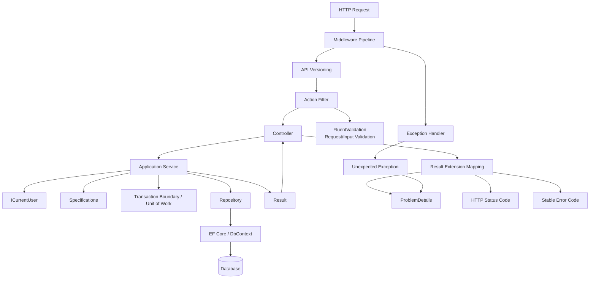

```mermaid
flowchart TD

    A["HTTP Request"] --> B["Middleware Pipeline"]

    B --> B1["Exception Handler"]

    B --> C["API Versioning"]

    C --> D["Action Filter"]
    D --> D1["FluentValidation<br/>Request/Input Validation"]

    D --> E["Controller"]

    E --> F["Application Service"]

    F --> F1["ICurrentUser"]
    F --> F2["Specifications"]
    F --> F3["Transaction Boundary / Unit of Work"]

    F --> G["Repository"]

    G --> H["EF Core / DbContext"]

    H --> I[("Database")]

    F --> R["Result<T>"]

    R --> E

    E --> P["Result Extension Mapping"]

    P --> P1["ProblemDetails"]
    P --> P2["HTTP Status Code"]
    P --> P3["Stable Error Code"]

    B1 --> X["Unexpected Exception"]
    X --> P1
```
